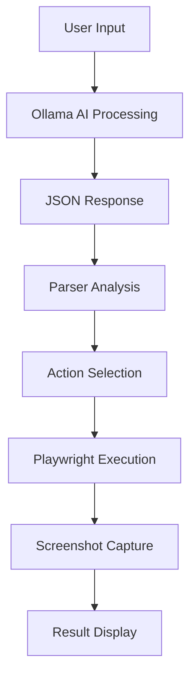

# Car Rental Automation Testing

An intelligent automation testing framework that uses AI to convert natural language commands into automated browser actions for testing a car rental website. The system combines Ollama AI model with Playwright for seamless test automation.

## 🚀 Features

- **Natural Language Processing**: Convert plain English commands into structured test actions
- **AI-Powered Parsing**: Uses Ollama's TinyLlama model to understand user intent
- **Visual Testing**: Automatic screenshot capture for each action
- **Comprehensive Car Rental Testing**: Supports all major car rental website functionalities
- **Error Handling**: Robust error handling with visual feedback

## 📋 Supported Actions

1. **Car Search**: Search for specific car models
2. **Booking Form**: Fill out rental booking forms with custom data
3. **Form Submission**: Submit completed booking forms
4. **Form Reset**: Clear all form fields
5. **Navigation**: Navigate between different sections of the website
6. **Contact Testing**: Test contact links and dialogs
7. **Pricing Check**: Retrieve pricing information for different car types
8. **Form Validation**: Test empty form validation
9. **Car Details**: Check specific car type details

## 🛠️ Installation

### Prerequisites

- Python 3.7+
- Ollama installed and running
- TinyLlama model downloaded in Ollama
- Node.js (if using local server features)

### Dependencies

```bash
pip install pytest-playwright
playwright install
pip install requirement.txt 
```


### Ollama Setup

1. Install Ollama from [https://ollama.ai](https://ollama.ai)
2. Pull the TinyLlama model:
```bash
ollama pull tinyllama
```
3. Test Ollama connection:
```bash
python testollama.py
```

This will verify that Ollama is running correctly and the TinyLlama model is accessible.

## 📁 Project Structure

```
├── entry.py              # Console-based entry point
├── gui.py                 # GUI interface using Tkinter
├── client.py              # Ollama AI client interface
├── parser.py              # JSON response parser
├── playwright_actions.py  # Browser automation actions
├── config.py              # Configuration settings
└── testollama.py          # Ollama connection test script
```

## 🚀 Usage

### Pre-flight Check

Before starting, test your Ollama setup:

```bash
python config.py
python testollama.py
```

### Console Interface

```bash
python entry.py
```

### Example Commands

**Search for cars:**
```
Search for BMW cars
```

**Fill booking form:**
```
Fill the booking form 
```

**Check pricing:**
```
Check SUV pricing
```

**Test functionality:**
```
Reset the booking form
```

### Advanced Usage Examples

**Custom booking with specific details:**
```
Book a VAN from 2025-08-15 to 2025-08-20 for John Smith
```

**Navigation testing:**
```
Check the contact section
```

### GUI Interface (Recommended)

Run the graphical interface for an enhanced user experience:

```bash
python gui.py
```

The GUI provides:
- User-friendly input interface
- Visual feedback and results
- Screenshot display
- Action history
- Easy command selection

### Form Data Structure

The booking form accepts the following fields:

```json
{
  "name": "Customer Name",
  "email": "email@example.com",
  "start_date": "2025-08-01",
  "end_date": "2025-08-07",
  "car_type": "SUV|VAN|Luxury",
  "cdw": true,
  "terms": true
}
```

### Car Types

- **SUV**: Sports Utility Vehicle
- **VAN**: Large passenger van
- **Luxury**: Premium luxury vehicles

## 📸 Screenshot Capture

The system automatically captures screenshots at key moments:

- Initial page load
- Before and after each action
- Error states
- Final results

Screenshots are processed and resized for optimal viewing.

## 🔍 How It Works

1. **User Input**: Natural language command entered via console
2. **AI Processing**: Ollama processes the command using system prompts
3. **JSON Parsing**: Response is parsed to extract structured instructions
4. **Action Execution**: Playwright performs the browser automation
5. **Screenshot Capture**: Visual evidence is captured throughout the process

## 📊 JSON Action Format

The AI converts natural language to structured JSON:

```json
{
  "action": "search_car",
  "query": "BMW"
}
```

```json
{
  "action": "fill_booking_form",
  "form_data": {
    "name": "John Doe",
    "email": "john@example.com",
    "start_date": "2025-08-01",
    "end_date": "2025-08-07",
    "car_type": "SUV",
    "cdw": true,
    "terms": true
  }
}
```

## 🌐 Target Website

**Car Rental Website Repository**: `https://github.com/Acharya-Keerthana/automationdemo`

**Demo Website URL**: `https://automationdemo.vercel.app/`

This car rental website includes:
- Search functionality
- Booking forms
- Pricing tables
- Contact information
- Multiple car categories

The automation framework is designed to work with this specific car rental website structure.

## 🔄 Workflow




